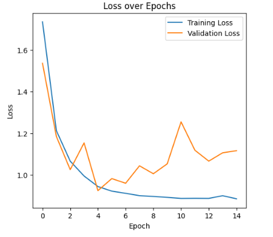
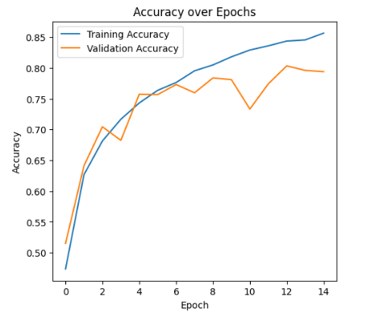
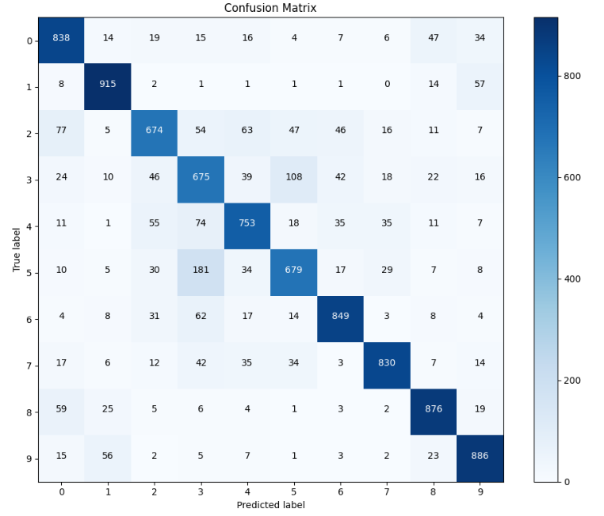
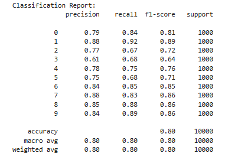
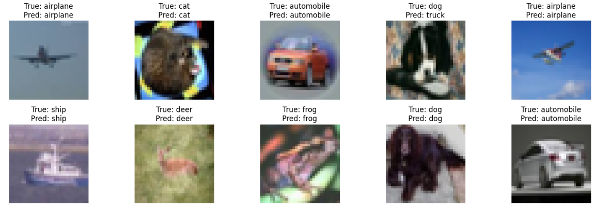

# 🖼️ Convolutional Neural Networks (CNN) for Image Classification with CIFAR-10

[](https://www.python.org/)
[](https://www.tensorflow.org/)
[](https://scikit-learn.org/stable/)
[](LICENSE)
[](https://www.kaggle.com/code/evangelosgakias/cnn-image-classification-tensorflow)

---

## 📈 Live Results

You can view the notebook with all outputs and results on Kaggle:  
[https://www.kaggle.com/code/evangelosgakias/cnn-image-classification-tensorflow](https://www.kaggle.com/code/evangelosgakias/cnn-image-classification-tensorflow)

---

## 📑 Table of Contents

- [Overview](#-overview)
- [Project Structure](#-project-structure)
- [Features](#-features)
- [Usage](#-usage)
- [Results](#-results)
- [Sample Visualizations](#-sample-visualizations)
- [Future Improvements](#-future-improvements)
- [Contributing](#-contributing)
- [License](#-license)
- [Contact](#-contact)

---

## 📋 Overview

This project demonstrates how to build, train, and evaluate a Convolutional Neural Network (CNN) for image classification using the CIFAR-10 dataset. The implementation leverages TensorFlow and Keras to construct a deep learning model that automatically learns hierarchical features from images, progressing from low-level features (e.g., edges, textures) to high-level representations (e.g., objects, shapes).

The CIFAR-10 dataset consists of 60,000 32x32 color images in 10 classes, with 6,000 images per class. The 10 classes represent airplanes, cars, birds, cats, deer, dogs, frogs, horses, ships, and trucks.

## 🏗️ Project Structure

```
.
├── CNN.ipynb               # Jupyter notebook with the complete implementation
├── README.md               # Project documentation (this file)
├── requirements.txt        # Python dependencies
├── .gitignore              # Specifies intentionally untracked files to ignore
├── LICENSE                 # MIT License file
└── figures/                # Screenshots and result images for the README (not tracked by git)
```

## 🚀 Features

### Data Preparation
- **Dataset Loading**: Automatic download and loading of the CIFAR-10 dataset
- **Preprocessing**:
  - Image normalization (pixel values scaled to [0, 1])
  - One-hot encoding of class labels
  - Train/validation/test split (80%/10%/10%)

### Model Architecture
- **Convolutional Layers**: Multiple Conv2D layers with ReLU activation
- **Batch Normalization**: For faster convergence and stable training
- **Pooling Layers**: MaxPooling2D for dimensionality reduction
- **Regularization**: Dropout layers to prevent overfitting
- **Dense Layers**: Fully connected layers for classification
- **Output Layer**: Softmax activation for multi-class classification

### Training Process
- **Optimizer**: Adam with default parameters
- **Loss Function**: Categorical Cross-Entropy
- **Callbacks**:
  - Early Stopping: Halts training when validation loss stops improving
  - Model Checkpoint: Saves the best model based on validation accuracy

### Evaluation & Visualization
- **Metrics**: Accuracy, Loss, Precision, Recall, F1-Score
- **Visualizations**:
  - Training/Validation accuracy and loss curves
  - Confusion matrix
  - Sample predictions with true vs. predicted labels

## 🚦 Usage

### Local Setup

1. **Clone the repository from GitHub:**
   ```bash
   git clone https://github.com/EvanGks/cifar10-image-classification-cnn.git
   cd cifar10-image-classification-cnn
   ```

2. **Create and activate a virtual environment:**

   **On Windows:**
   ```bash
   python -m venv .venv
   .venv\Scripts\activate
   ```
   **On macOS/Linux:**
   ```bash
   python3 -m venv .venv
   source .venv/bin/activate
   ```

3. **Install dependencies:**
   ```bash
   pip install -r requirements.txt
   ```

4. **Open the Jupyter Notebook:**
   ```bash
   jupyter notebook CNN.ipynb
   ```
   Or run directly on Kaggle:
   [](https://www.kaggle.com/code/evangelosgakias/cnn-image-classification-tensorflow)

5. **Run the notebook cells in order:**
   - The notebook is organized in a sequential manner
   - Each section is well-documented with explanations
   - All visualizations will be displayed inline

## 📊 Results

The model achieves the following performance (as shown in the [Kaggle notebook](https://www.kaggle.com/code/evangelosgakias/cnn-image-classification-tensorflow)):

| Metric              | Score    |
|---------------------|----------|
| Training Loss       | 0.8856   |
| Training Accuracy   | 84.24%   |
| Validation Loss     | 1.0660   |
| Validation Accuracy | 80.34%   |
| Test Loss           | 1.079    |
| Test Accuracy       | 79.75%   |
| Precision           | 80.00%   |
| Recall              | 80.00%   |
| F1-Score            | 80.00%   |

- **Test Accuracy:** 79.75%
- **Test Loss:** 1.079
- **Validation Accuracy:** 80.34%
- **Validation Loss:** 1.0660
- **Training Accuracy:** 84.24%
- **Training Loss:** 0.8856
- **Classification Report:**
  - Precision, recall, and F1-score for each class are all around 80%, indicating balanced performance across all categories.
  - For full details and confusion matrix, see the [Kaggle notebook results](https://www.kaggle.com/code/evangelosgakias/cnn-image-classification-tensorflow).

> **Note:** All metrics, plots, and outputs are available in the linked Kaggle notebook for full transparency and reproducibility.

## 🖼️ Sample Visualizations

Below are key visualizations from the [Kaggle notebook](https://www.kaggle.com/code/evangelosgakias/cnn-image-classification-tensorflow).  
All images are available in the `/figures` directory (not tracked by git).

<p align="center">
  
  <br>
  <em>Figure 1: Training and validation loss curves. The model shows convergence and some overfitting, as validation loss is higher than training loss.</em>
</p>

<p align="center">
  
  <br>
  <em>Figure 2: Training and validation accuracy curves. Validation accuracy closely tracks training accuracy, indicating reasonable generalization.</em>
</p>

<p align="center">
  
  <br>
  <em>Figure 3: Confusion matrix for test set predictions. Most values are concentrated along the diagonal, indicating good accuracy across all classes.</em>
</p>

<p align="center">
  
  <br>
  <em>Figure 4: Classification report for test set predictions. Most classes have precision, recall, and f1-score around 0.80.</em>
</p>

<p align="center">
  
  <br>
  <em>Figure 5: Example test images with true and predicted labels. Most predictions are correct, with a few misclassifications.</em>
</p>

## 🛠️ Future Improvements

- Experiment with deeper and more complex architectures (e.g., ResNet, VGG, EfficientNet)
- Apply data augmentation techniques to increase training data diversity
- Perform hyperparameter tuning (learning rate, batch size, dropout rates)
- Explore additional regularization methods (L1/L2 regularization)
- Implement transfer learning using pre-trained models on larger datasets (e.g., ImageNet)
- Add TensorBoard integration for better training visualization

## 🤝 Contributing

Contributions are welcome! Please feel free to submit a Pull Request. For major changes, please open an issue first to discuss what you would like to change.

## 📝 License

This project is licensed under the MIT License - see the [LICENSE](LICENSE) file for details.

## 📧 Contact

For questions or feedback, please contact Evangelos Gakias at [evangelos.gakias@gmail.com](mailto:evangelos.gakias@gmail.com) or open an issue in the repository.

---
Happy Coding! 🚀